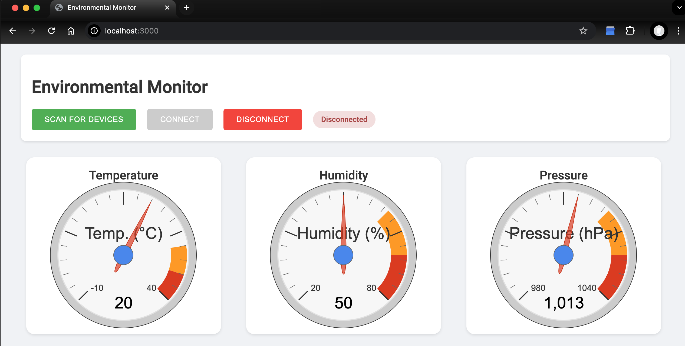

# m5atom
M5Atom esp32 with ENV III sensors
The code is split between the server (Atom-web-monitor folder) and the bluetooth client running in a Web browser (Atom Client folder).
The server connect to your own Wifi network with the ssid/password you define in the main.cpp file :
/ WiFi credentials
const char* ssid = "XXXXX";
const char* password = "XXXXXX";

The BLE client running in your browser will scan the BLE devices and after you select the M5Atom you'll see 3 jauges.
The index.html page must be open in a Web server. The simplest way is to launch python simple server with :
$ python3 -m http.server 3000

And then open http://localhost:3000

